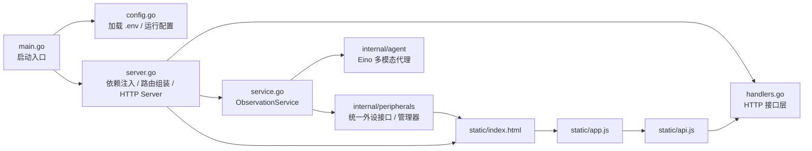
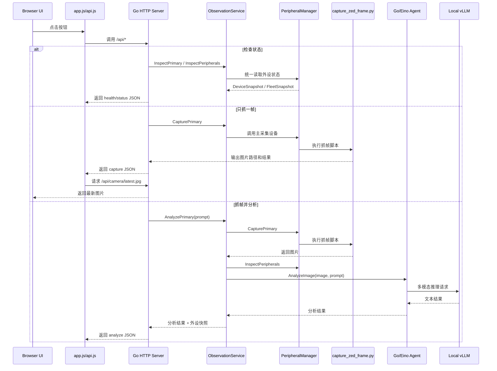

# Eino VLM Agent Demo

这套工程用于在 Jetson 本地验证并扩展这条链路：

`ZED 2i -> Jetson 本地抓帧脚本 -> Go/Eino agent -> 本地 vLLM`

它不依赖 `live-vlm-webui`。`webui` 只作为之前排查消息链路时的参考，不参与这里的运行闭环。

## 本次解耦说明

这轮修改在保持原有链路可用的前提下，补了一层统一的外设注入模型，目标是让深度相机、雷达、串口传感器、ROS topic 探针都走同一套配置和接口。

保持不变的部分：

- 摄像头抓帧链路仍然是 `ZED 2i -> scripts/capture_zed_frame.py`
- 推理链路仍然是 `Go/Eino agent -> 本地 vLLM`
- 页面访问地址仍然是 `http://127.0.0.1:18080`
- 原有关键接口仍然可用：`/api/health`、`/api/camera/status`、`/api/camera/capture`、`/api/camera/latest.jpg`、`/api/capture-and-analyze`
- 前端仍然通过同一组后端 API 完成检查、抓帧、预览、分析

这次新增的边界：

- 前端脚本从 `index.html` 内联逻辑拆到独立模块
- 运行配置从硬编码迁到 `.env`
- `main.go` 从“大入口文件”拆成启动、配置、server、handler 几层
- 新增统一外设配置 `configs/peripherals.json`
- 新增外设驱动接口 `internal/peripherals`
- 新增 `ObservationService`，让 agent 编排层直接拿到“抓帧能力 + 外设快照”

## 架构图

### 1. 代码职责解耦图



### 2. 运行链路图



## 结构

- `cmd/jetson_camera_agent`
  - Jetson 本地 HTTP 服务
  - `main.go`
    - 启动入口
  - `config.go`
    - `.env` 与运行配置加载
  - `server.go`
    - 依赖注入、静态资源挂载、路由组装
  - `service.go`
    - ObservationService，统一编排抓帧、外设快照、agent 推理
  - `handlers.go`
    - HTTP handler 与请求编排
  - `static/`
    - 前端页面与已解耦的 JS 模块
- `internal/peripherals`
  - 统一外设抽象、设备管理器、驱动适配层
- `internal/camera`
  - 具体摄像头抓帧实现
- `internal/agent`
  - Eino 多模态代理封装
- `configs/peripherals.json`
  - 所有外设的统一配置入口
- `scripts/capture_zed_frame.py`
  - 直接通过 ZED SDK 抓单帧

## 配置

运行配置已经从代码里剥离到 `.env`。

首次使用：

```bash
cd ~/inference/eino-vlm-agent-demo
cp .env.example .env
```

按需修改这些关键项：

- `JETSON_AGENT_LISTEN_ADDR`
- `OPENAI_BASE_URL`
- `OPENAI_API_KEY`
- `OPENAI_MODEL_NAME`
- `VISION_SYSTEM_PROMPT`
- `JETSON_DEFAULT_PROMPT`
- `JETSON_UI_TITLE`
- `JETSON_UI_DESCRIPTION`
- `JETSON_PERIPHERAL_CONFIG`

前端默认标题、描述、prompt 不再硬编码在 HTML/JS 中，而是由后端通过 `GET /api/config` 下发。

所有外设统一走 `configs/peripherals.json`。当前支持的设备描述字段：

- `name`
  - 设备实例名，如 `front-zed`、`front-radar`
- `kind`
  - 设备类型，如 `depth_camera`、`radar`
- `driver`
  - 驱动类型，当前内置 `zed` 和 `exec`
- `metadata`
  - 挂载位、总线类型、用途等扩展信息
- `capture`
  - 采集配置；主采集设备需要这个字段
- `checks`
  - 状态探测命令数组；所有外设都可复用

一个深度相机、毫米波雷达、串口设备都可以在同一个配置文件中并列描述，server 启动时统一加载成外设管理器。

## 依赖

- Jetson 上本地 vLLM 已运行:
  - `http://127.0.0.1:8000/v1`
  - model: `Qwen3.5-2B-local`
- Go 已安装
- Python3 可导入:
  - `pyzed`
  - `cv2`

## 运行

```bash
cd ~/inference/eino-vlm-agent-demo
go mod tidy
go build ./cmd/jetson_camera_agent

./jetson_camera_agent
```

访问:

```bash
http://127.0.0.1:18080
```

## Jetson 上的实际使用方法

当前 Jetson 本地服务监听：

```bash
127.0.0.1:18080
```

直接在 Jetson 本机浏览器打开：

```bash
http://127.0.0.1:18080
```

## 管理脚本

工程目录里带了一个管理脚本：

```bash
~/inference/eino-vlm-agent-demo/manage_jetson_camera_agent.sh
```

常用命令：

```bash
cd ~/inference/eino-vlm-agent-demo

./manage_jetson_camera_agent.sh start
./manage_jetson_camera_agent.sh stop
./manage_jetson_camera_agent.sh restart
./manage_jetson_camera_agent.sh status
./manage_jetson_camera_agent.sh health
./manage_jetson_camera_agent.sh capture
./manage_jetson_camera_agent.sh preview-head
./manage_jetson_camera_agent.sh analyze "Describe the current camera view briefly."
./manage_jetson_camera_agent.sh logs
```

用途说明：

- `start`
  - 编译并启动 `127.0.0.1:18080` 的服务
- `stop`
  - 停止当前 camera agent
- `restart`
  - 重启服务
- `status`
  - 查看当前进程和监听配置
- `health`
  - 检查 agent 到本地 vLLM 是否可用
- `capture`
  - 直接抓一帧
- `preview-head`
  - 检查最新抓图接口 `/api/camera/latest.jpg`
- `analyze`
  - 抓帧并交给 Go/Eino agent
- `logs`
  - 查看 `/tmp/jetson_camera_agent.log`

页面里的按钮对应关系：

- `检查 vLLM`
  - 验证本地 `http://127.0.0.1:8000/v1` 是否可用
- `检查摄像头状态`
  - 查看当前主采集设备的统一状态快照
- `只抓一帧`
  - 直接从 Jetson 本机抓一张图片
  - 抓完后页面会显示最新抓到的图片预览
- `抓帧并交给 Agent`
  - 先抓一帧
  - 再把这张图交给 Go/Eino agent
  - 最后调用 Jetson 本地 vLLM 返回文本结果

如果你想直接测接口，可以在 Jetson 上执行：

```bash
curl http://127.0.0.1:18080/api/peripherals
curl http://127.0.0.1:18080/api/health
curl http://127.0.0.1:18080/api/camera/status
curl http://127.0.0.1:18080/api/camera/capture
curl -I http://127.0.0.1:18080/api/camera/latest.jpg
curl -X POST http://127.0.0.1:18080/api/capture-and-analyze \
  -H 'Content-Type: application/json' \
  -d '{"prompt":"Describe the current camera view briefly."}'
```

图片预览接口：

```bash
http://127.0.0.1:18080/api/camera/latest.jpg
```

如果页面能看到最新抓图，说明这条链已经通了：

```text
ZED 2i -> Jetson 本地抓帧 -> 18080 服务
```

如果 `抓帧并交给 Agent` 也返回文本，说明完整链路已经通了：

```text
ZED 2i -> Jetson 本地抓帧 -> Go/Eino agent -> 本地 vLLM
```

## 测试接口

- `GET /api/config`
  - 下发前端运行时配置，包括标题、描述和默认 prompt
- `GET /api/peripherals`
  - 返回所有已注入外设的统一状态快照
- `GET /api/health`
  - 检查本地 vLLM `/v1/models`
- `GET /api/camera/status`
  - 检查主采集设备状态
- `GET /api/camera/capture`
  - 直接抓一帧，不跑模型
- `POST /api/capture-and-analyze`
  - 直接抓一帧并交给 Go/Eino agent
  - 响应里附带当前外设快照，便于上层 agent 框架统一消费

## 结果解释

如果 `capture` 就失败，说明问题在 ZED SDK / 设备开流层，还没有进入 agent。

如果 `capture` 成功但 `capture-and-analyze` 失败，说明问题在 Eino / vLLM 调用层。
